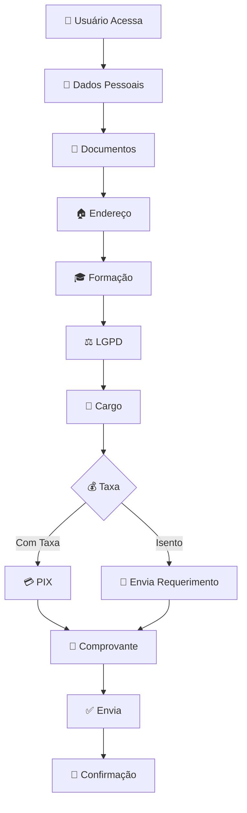

# 📝 Formulário de Inscrição – Agência Peixe Vivo

<div align="center">


*Sistema moderno de inscrição com validação inteligente e integração PIX.*

</div>

---

## 🌟 Visão Geral

Sistema web completo para gerenciamento de inscrições em processos seletivos, com navegação por etapas, validações avançadas, integração PIX e experiência moderna para o usuário.

---

## 🚀 Funcionalidades Principais

### 📋 Cadastro Inteligente
- Formulário **multi-etapas** com barra de progresso.
- **Validação em tempo real**.
- **Prevenção de duplicidade** por CPF.
- **Campos dinâmicos** conforme seleção do usuário.

### 🎯 Validações Avançadas
- **CPF**: validação completa + formatação.
- **CEP**: consulta automática via API.
- **E-mail** e **telefone** com formatação automática.
- **Campos obrigatórios** com mensagens claras.

### 💰 Sistema de Taxas Integrado
- Valores dinâmicos por cargo (R$50, R$70, R$120).
- Opção de **isenção** com upload de requerimento.
- **PIX** integrado com QR Code.
- Sincronização entre cargo ↔ valor da taxa.

### 🛡️ Segurança e LGPD
- Consentimento explícito.
- Tratamento seguro no frontend e backend.
- Prevenção de múltiplos envios.

---

## 🛠 Tecnologias Utilizadas

| Tecnologia | Função | Versão |
|-----------|--------|--------|
| HTML5 | Estrutura semântica | 5 |
| CSS3 | Estilos modernos | 3 |
| JavaScript | Interatividade e validações | ES6+ |
| Google Apps Script | Backend e planilhas | - |

---

## 📁 Estrutura do Projeto

```
formulario-inscricao/
│
├── index.html              # Página principal
├── style.css               # Estilos
├── script.js               # Lógica do sistema
│
├── img/
│   ├── cabecalho.png
│   ├── AuxAdm.png
│   ├── analista.png
│   └── Coordenador.png
│
├── confirmacao/
│   └── confirmacao.html
│
└── obrigado/
    └── obrigado.html
```

---

## ⚙️ Configuração e Instalação

### ✔ Pré-requisitos
- Navegador moderno
- Servidor web (local ou remoto)
- Conta Google (Apps Script + Sheets)

### 🚀 Instalação Rápida

1. **Clone o repositório**
```bash
git clone https://github.com/usuario/repositorio.git
```

2. **Configure o backend (Google Apps Script)**
- Acesse: https://script.google.com/
- Crie novo projeto
- Cole o código do backend
- Configure:
```javascript
const scriptUrl = "hhttps://script.google.com/macros/s/AKfycbzb0Ps9bYV2m-473hxiLcdsjt9WD89w0kl_O_BnvJWDvDNJHok3_dytIKCLUgkGEDO_8Q/exec";
```

3. **Adicione imagens PIX**
   - Coloque na pasta `/img`
   - Atualize o `cargosConfig`:

```javascript
const cargosConfig = {
  "Novo Cargo": {
    valor: "R$ 100,00",
    valorTexto: "Novo Cargo - R$100,00",
    valorNumero: "100",
    imagem: "img/novo-cargo.png",
    chavePix: "sua-chave-pix"
  }
};
```

---

## 🎨 Personalização

### 🎨 Variáveis de Tema (CSS)
```css
:root {
  --primary-color: #2d89ff;
  --primary-dark: #1a6fd9;
  --secondary-color: #1D4ED8;
  --success-color: #28a745;
  --danger-color: #dc3545;
  --warning-color: #e74c3c;
  --text-dark: #2c3e50;
  --text-medium: #495057;
  --text-light: #6c757d;
  --bg-light: #f8f9fa;
  --bg-white: #ffffff;
  --border-color: #e9ecef;
  --border-radius: 12px;
  --transition: all 0.3s ease;
  --shadow: 0 10px 30px rgba(0,0,0,0.1);
  --shadow-sm: 0 4px 12px rgba(0,0,0,0.1);
}
```

---

## 🔄 Fluxo do Sistema



---

## 🔧 APIs e Integrações

### Google Apps Script
- Processamento das inscrições
- Verificação de duplicatas
- Armazenamento no Google Sheets

### ViaCEP API
- Consulta automática de endereço por CEP

### Sistema PIX
- QR Codes dinâmicos
- Chave PIX copiável
- Valor automático por cargo

---

## ♿ Acessibilidade

- Navegação por teclado  
- Contraste otimizado  
- Layout responsivo totalmente fluido  
- Labels semânticos em todos os campos  

---

## 📱 Responsividade

| Dispositivo | Layout | Recursos |
|-------------|--------|----------|
| 📱 Mobile | Coluna única | Toque otimizado |
| 💻 Tablet | Colunas adaptáveis | Navegação fluida |
| 🖥️ Desktop | Completo | 100% das funções |

---

## 🚨 Validações Implementadas

### CPF
- Formatação automática  
- Dígitos verificadores  
- Bloqueio de sequências inválidas  
- Verificação de duplicidade  

### Arquivos
- Extensões: PDF, JPG, JPEG, PNG  
- Limite configurável  

### Campos Obrigatórios
- Erros claros  
- Destaque visual  
- Validação dinâmica  

---

## 🔒 LGPD e Segurança

- Consentimento explícito  
- Coleta mínima necessária  
- Dados armazenados somente na Agência Peixe Vivo  
- Direito de revogação garantido  

---

## 🧩 Suporte e Manutenção

### Problemas Comuns
- CPF não valida → conferir todos os dígitos  
- CEP não consulta → verificar conexão  
- Erro no envio → conferir tamanho do arquivo  

### Logs
```javascript
console.log("🔍 Debug ativado");
```
---

## 👥 Créditos e Desenvolvimento

Desenvolvido por: **Thiago Feldner – InterOp**  
Para: **Agência Peixe Vivo**  
Tipo: **Sistema de Inscrição para Processo Seletivo**


---

## 📄 Licença

© 2025 Agência Peixe Vivo – Todos os direitos reservados.  
Uso exclusivo para processos seletivos internos.

---

<div align="center">

🎊 **Sistema em Produção – Funcionando Perfeitamente!**  
📅 Última atualização: **Dezembro/2025**

[⬆ Voltar ao topo](#-formulário-de-inscrição--agência-peixe-vivo)

</div>
